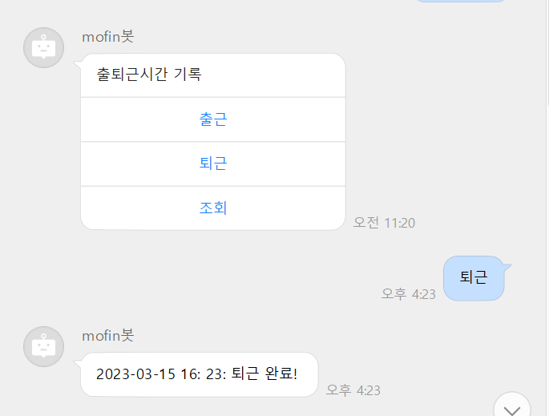

# MOFIN BOT
회사에서 Naverworks를 사용하기 시작했고.. 근태관리 시스템이 없어서 직접 만들어 보았어요...
 
 왜 sample 봇들이 없는거야... ㅠㅠ


## 1. Description
------------------------
근태관리 NAVER WORKS message bot by python flask

- 출퇴근 시간 기록
- naverworks 개인 상태 변경



### To-do
----
- 성능 향상
    - async, await...
- DB (출퇴근 기록 저장) 관리 시스템


## run

### Prerequisite
- python 3.x
- flask
- flask-apscheduler
---
```
python main.py
```

-> localhost:5000 실행
- ngrok 이용하여 callbackurl 구성함